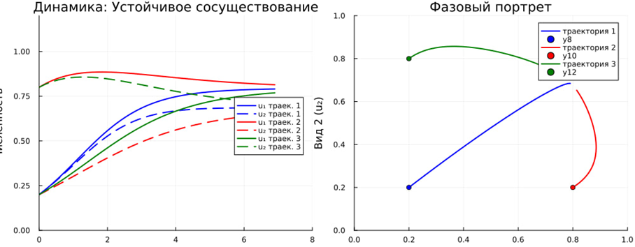
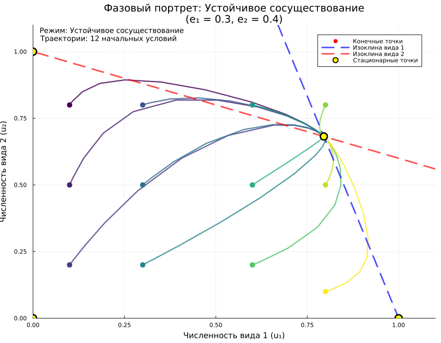
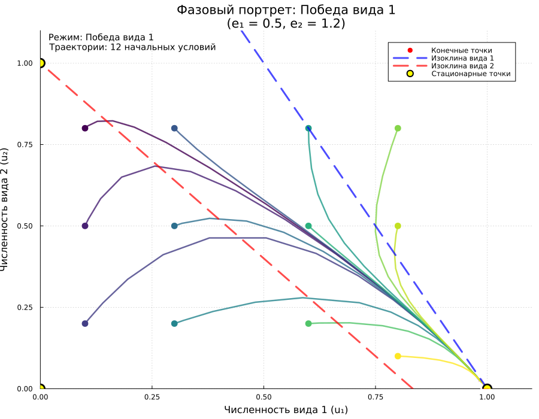

# Цель работы

Исследование динамики системы конкуренции двух видов с использованием математического моделирования и компьютерной визуализации. Анализ различных режимов взаимодействия видов в зависимости от параметров конкуренции.

## Теоретическая основа

Модель основана на системе дифференциальных уравнений Лотки-Вольтерры для конкуренции двух видов:

$$
\begin{aligned}
\frac{du_1}{dt} &= u_1(1 - u_1 - e_1 u_2) \\
\frac{du_2}{dt} &= u_2(1 - u_2 - e_2 u_1)
\end{aligned}
$$

**где:**
- $u_1$, $u_2$ — численности видов 1 и 2 (нормированные на ёмкость среды)
- $e_1$, $e_2$ — коэффициенты конкуренции, показывающие влияние одного вида на другой


### Что значит данная модель и в каких случаях используется
Данная модель описывает динамику численности двух видов, конкурирующих за общие ресурсы. 
Она является классической и широко используется в теоретической экологии. Наиболее известная модель конкурентных взаимодействий была предложена в 20-х годах итальянским математиком Вито Вольтерра и американским биологом Альфредом Лоткой. 
Она представляет собой прямое обобщение логистического уравнения роста популяции на случай конкуренции двух видов за один ресурс. 
Модель Лотки–Вольтерра для двух конкурентов и по сей день остается основной при анализе межвидовой конкуренции. 
Модели межвидовой конкуренции применяются для предсказания динамики численности конкурирующих видов, 
для оценки вероятности их сосуществования в долговременной перспективе, а также для анализа исходов экспериментального или природного вселения видов в новые сообщества.


### Все сущности и связи в модели

Модель описывает взаимовлияние двух популяций через их отрицательное воздействие друг на друга. В этой системе два вида x и y отрицательно влияют друг на друга, так как каждый из них потребляет один и тот же ресурс, необходимый другому виду. Это влияние учитывается с помощью дополнительных членов в логистических уравнениях. Связь между популяциями осуществляется через коэффициенты конкуренции a и b, которые показывают, насколько сильное угнетающее действие оказывает один вид на рост другого по сравнению с внутривидовой конкуренцией.


### Переменные и коэффициенты в формулах
Классическое представление модели и описание параметров выглядит следующим образом. Рассмотрим систему двух логистических уравнений, описывающих конкуренцию двух видов за ресурсы:


## Математическая модель

$$
\begin{aligned}
\frac{dx}{dt} &= r_1 x \left( 1 - \frac{x + a_{12} y}{K_1} \right) \\
\frac{dy}{dt} &= r_2 y \left( 1 - \frac{y + a_{21} x}{K_2} \right)
\end{aligned}
$$

### Параметры системы

| Параметр | Описание |
|----------|-----------|
| $x$, $y$ | Численности видов |
| $r_1$, $r_2$ | Скорости роста |
| $K_1$, $K_2$ | Ёмкости среды |
| $a_{12}$ | Влияние вида 2 на вид 1 |
| $a_{21}$ | Влияние вида 1 на вид 2 |


Коэффициент **a** можно интерпретировать как меру влияния второго вида на первый в единицах влияния первого вида на самого себя. Например, если a=2, то это означает, что одна особь вида y подавляет рост популяции x так же, как две особи самого вида x.


### Влияние параметров на поведение системы

Поведение системы и исход конкуренции критически зависят от соотношения коэффициентов конкуренции и ёмкостей среды.

Анализ стационарных состояний системы показывает, что возможны четыре исхода конкуренции:

1. **Вытеснение вида $x$ видом $y$**: это происходит, если $a_{21} < K_2/K_1 \wedge a_{12} > K_1/K_2$

2. **Вытеснение вида $y$ видом $x$**: это происходит, если $a_{21} > K_2/K_1 \wedge a_{12} < K_1/K_2$

3. **Неустойчивое сосуществование** (исход зависит от начальных численностей): если $a_{21} > K_2/K_1 \wedge a_{12} > K_1/K_2$

4. **Устойчивое сосуществование обоих видов**: если $a_{21} < K_2/K_1 \wedge a_{12} < K_1/K_2$

Принцип конкурентного исключения Гаузе, сформулированный на основе экспериментов с инфузориями, находит свое математическое выражение в модели Лотки–Вольтерра. Устойчивое сосуществование двух видов в модели возможно лишь в том случае, когда внутривидовая конкуренция у каждого вида сильнее, чем межвидовая. То есть, когда каждый вид ограничивает сам себя сильнее, чем его ограничивает конкурент.

### Аналитическое описание поведения системы

Качественный анализ модели позволяет предсказать долгосрочный исход конкуренции.
### Анализ стационарных состояний

Поведение системы (1) определяется свойствами ее стационарных точек. Неподвижные точки находятся из условий $dx/dt = 0$ и $dy/dt = 0$. Кроме тривиальной точки $(0,0)$ и точек, соответствующих существованию только одного вида $(K_1, 0)$ и $(0, K_2)$, существует четвертая стационарная точка — нетривиальное равновесие с положительными численностями обоих видов. Устойчивость этой точки и определяет возможность сосуществования.

Графически условия сосуществования можно представить на фазовой плоскости. Изоклины нулевого роста — прямые линии $x + a_{12}y = K_1$ и $y + a_{21}x = K_2$. Взаимное расположение этих изоклин определяет, какая из стационарных точек будет устойчивым узлом, то есть к какому исходу придет система. Если изоклины пересекаются в первом квадранте так, что образуется устойчивый узел, то виды сосуществуют. Если же устойчивым узлом становится точка на одной из осей, то это означает вытеснение одного из видов.

### Общий вид модели и биологический смысл коэффициентов

Рассмотрим теперь стандартную модель конкуренции двух видов в форме Колмогорова:

$$
\begin{cases}
\dot{x}_1 = x_1 f_1(x_1, x_2), \\
\dot{x}_2 = x_2 f_2(x_1, x_2),
\end{cases}
$$

где функции $f_1, f_2$ — гладкие и описывают удельные скорости роста популяций. В случае, когда конкуренция линейна, получаем:

$$
\begin{cases}
\dot{x}_1 = x_1(a_1 - e_{11}x_1 - e_{12}x_2), \\
\dot{x}_2 = x_2(a_2 - e_{22}x_2 - e_{21}x_1).
\end{cases}
$$

Здесь $a_1, a_2$ — мальтузианские коэффициенты, $e_{11}, e_{22}$ — коэффициенты внутривидовой конкуренции, $e_{12}, e_{21}$ — коэффициенты межвидовой конкуренции.

### О преимуществах такой параметризации

Запись модели в форме с коэффициентами $e_{ij}$ обладает тем преимуществом, что она делает явной линейную структуру конкурентных взаимодействий. Коэффициент $e_{12}$ имеет смысл меры ингибиторного эффекта, который оказывает одна особь вида 2 на удельную скорость роста вида 1.

### Анализ условий сосуществования

Условия устойчивого сосуществования двух видов в модели с параметрами $e_{ij}$ принимают особенно простой и симметричный вид:

$$
\frac{e_{12}}{e_{22}} < \frac{a_1}{a_2} < \frac{e_{11}}{e_{21}}
$$

где выполнение этого двойного неравенства гарантирует возможность длительного сосуществования обоих видов.

Эти неравенства имеют глубокий экологический смысл: для сосуществования необходимо, чтобы межвидовая конкуренция была достаточно слаба по сравнению с внутривидовой.

### Связь с ёмкостями среды и классическими параметрами

Параметры $e_{ij}$ непосредственно связаны с традиционными параметрами модели Вольтерры. Если ввести ёмкости $K_1 = a_1 / e_{11}$, $K_2 = a_2 / e_{22}$ и коэффициенты конкуренции $a = e_{12}/e_{22}$, $b = e_{21}/e_{11}$, то мы получим классическую форму модели конкуренции.

### Физический смысл коэффициентов

Коэффициенты $e_{ij}$ имеют размерность [1/(особь × время)] и могут быть непосредственно измерены в экспериментах. Например, $e_{12}$ показывает, насколько уменьшится удельная скорость роста вида 1 при добавлении одной особи вида 2.

## Методика исследования

### 1. Реализация математической модели

Для численного решения системы использован метод Эйлера. Шаг интегрирования $d_t = 0.1$, время моделирования $T = 20.0$ единиц.

```julia
function competition_system1(x, p)
    e1, e2 = p
    u1, u2 = x
    du1 = u1 * (1 - u1 - e1 * u2)
    du2 = u2 * (1 - u2 - e2 * u1)
    return [du1, du2]
end
```
## 2. Численное интегрирование

Реализована функция `solve_competition`, которая выполняет численное интегрирование системы методом Эйлера:

```julia
function solve_competition(u0, e1, e2, T=20.0, dt=0.1)
    times = 0:dt:T
    n_steps = length(times)
    U = zeros(n_steps, 2)
    U[1, :] = u0

    for i in 2:n_steps
        du = competition_system1(U[i-1, :], (e1, e2))
        U[i, :] = U[i-1, :] + dt * du
    end
    return times, U
end
```

{ #fig:003 width=100% height=100% }

{ #fig:004 width=100% height=100% }


### Сценарий 2: Победа вида 1

**Параметры:** $e_1 = 0.5$, $e_2 = 1.2$

**Условие:** $e_1 < 1$ и $e_2 > 1$

Вид 2 полностью вытесняется, вид 1 достигает максимальной численности. Равновесие системы: $(1, 0)$. Фазовый портрет показывает, что все траектории сходятся к точке на оси $u_1$.

{ #fig:005 width=100% height=100% }

{ #fig:006 width=100% height=100% }


### Сценарий 3: Победа вида 2

**Параметры:** $e_1 = 1.2$, $e_2 = 0.5$

**Условие:** $e_1 > 1$ и $e_2 < 1$

Вид 1 полностью вытесняется, вид 2 достигает максимальной численности. Равновесие системы: $(0, 1)$. Траектории сходятся к точке на оси $u_2$.

{ #fig:007 width=100% height=100% }

{ #fig:008 width=100% height=100% }


## Анимированные представления

Созданы две анимации для наглядной демонстрации динамики системы:

1. **Анимация одной траектории** - показывает синхронную эволюцию временных рядов и фазового портрета

2. **Анимация нескольких траекторий** - демонстрирует зависимость конечного состояния от начальных условий


{ #fig:009 width=100% height=100% }

{ #fig:010 width=100% height=100% }

# Исследование и построение имитационной модели

## Постановка задачи

Для исследования динамики системы конкуренции двух видов была разработана имитационная модель на языке программирования Julia. Модель основана на системе дифференциальных уравнений Лотки-Вольтерры:

$$
\begin{aligned}
\frac{dx}{dt} &= r_1 x \left( 1 - \frac{x + a_{12} y}{K_1} \right) \\
\frac{dy}{dt} &= r_2 y \left( 1 - \frac{y + a_{21} x}{K_2} \right)
\end{aligned}
$$

## Методы исследования

### 1. Численное интегрирование

Для решения системы дифференциальных уравнений использован метод Эйлера с фиксированным шагом интегрирования. Реализована функция численного интегрирования:

```julia
function solve_competition(u0, e1, e2, T=20.0, dt=0.1)
    times = 0:dt:T
    n_steps = length(times)
    U = zeros(n_steps, 2)
    U[1, :] = u0
    
    for i in 2:n_steps
        du = competition_system1(U[i-1, :], (e1, e2))
        U[i, :] = U[i-1, :] + dt * du
    end
    return times, U
end
```
### 2. Параметризация модели

Были исследованы различные комбинации параметров конкуренции для выявления основных режимов системы:

- **Коэффициенты конкуренции**: $a_{12}$, $a_{21}$ варьировались в диапазоне [0.1, 2.0]
- **Начальные условия**: исследованы различные начальные численности видов
- **Время моделирования**: $T = 20$ единиц времени с шагом $dt = 0.1$

### 3. Визуализация результатов

Разработаны функции для комплексной визуализации динамики системы:

- **Фазовые портреты** - отображение траекторий в пространстве состояний
- **Временные ряды** - динамика численностей видов во времени
- **Анимации** - интерактивное представление эволюции системы

### Реализация имитационной модели

### Основная система уравнений
```julia
function competition_system1(x, p)
    e1, e2 = p
    u1, u2 = x
    du1 = u1 * (1 - u1 - e1 * u2)
    du2 = u2 * (1 - u2 - e2 * u1)
    return [du1, du2]
end
```

**Описание функции:**

- **Назначение**: Вычисляет правые части системы дифференциальных уравнений Лотки-Вольтерры для конкуренции двух видов

- **Входные параметры**:
  - `x` - вектор текущих численностей видов [u₁, u₂]
  - `p` - кортеж параметров (e₁, e₂), где e₁, e₂ - коэффициенты конкуренции

- **Выходные данные**: Вектор производных [du₁/dt, du₂/dt]

- **Математическая основа**: Моделирует логистический рост с учетом межвидовой конкуренции

- **Биологический смысл**: Каждый вид растет по логистическому закону, но скорость роста уменьшается в связи с конкуренцией со стороны другого вида


### Функция анализа устойчивости

```julia
function analyze_stability(e1, e2)
    if e1 < 1 && e2 < 1
        return "Устойчивое сосуществование"
    elseif e1 < 1 && e2 > 1
        return "Победа вида 1"
    elseif e1 > 1 && e2 < 1
        return "Победа вида 2"
    else
        return "Неустойчивое сосуществование"
    end
end
```

**Описание функции:**

- **Назначение**: Определение типа равновесия системы на основе параметров конкуренции

- **Критерии устойчивости**:
  - e₁ < 1 и e₂ < 1: оба вида слабо влияют друг на друга - сосуществование
  - e₁ < 1 и e₂ > 1: вид 2 сильно угнетает вид 1 - победа вида 2
  - e₁ > 1 и e₂ < 1: вид 1 сильно угнетает вид 2 - победа вида 1
  - e₁ > 1 и e₂ > 1: сильная взаимная конкуренция - неустойчивость

- **Теоретическое обоснование**: Критерии основаны на анализе собственных чисел матрицы Якоби системы

# Математические основы модели

## Система дифференциальных уравнений

Модель описывается системой:

$$
\begin{aligned}
\frac{du_1}{dt} &= u_1(1 - u_1 - e_1 u_2) \\
\frac{du_2}{dt} &= u_2(1 - u_2 - e_2 u_1)
\end{aligned}
$$

**Компоненты уравнений:**

- **Логистический рост**: $u_i(1 - u_i)$ - рост с ограничением по ресурсам
- **Межвидовая конкуренция**: $-e_i u_i u_j$ - угнетение роста в связи с конкуренцией
- **Нормированные переменные**: $u_1, u_2 \in [0,1]$ - относительные численности

## Стационарные точки системы

Система имеет четыре стационарные точки:

1. $(0, 0)$ - вымирание обоих видов  
2. $(1, 0)$ - победа вида 1  
3. $(0, 1)$ - победа вида 2  
4. $\left(\frac{1-e_1}{1-e_1 e_2}, \frac{1-e_2}{1-e_1 e_2}\right)$ - сосуществование

## Сценарии исследования

### Сценарий 1: Устойчивое сосуществование
**Параметры**: $e_1 = 0.3$, $e_2 = 0.4$  
**Результат**: Оба вида достигают стабильного равновесия с ненулевыми численностями

{ #fig:011 width=100% height=100% }

### Сценарий 2: Победа вида 1
**Параметры**: $e_1 = 0.5$, $e_2 = 1.2$  
**Результат**: Вид 2 вытесняется, вид 1 достигает максимальной численности

{ #fig:012 width=100% height=100% }

### Сценарий 3: Победа вида 2
**Параметры**: $e_1 = 1.2$, $e_2 = 0.5$  
**Результат**: Вид 1 вытесняется, вид 2 доминирует в системе

{ #fig:013 width=100% height=100% }

## Визуализация и анимация

### Анимация одной траектории
Демонстрирует синхронную эволюцию временных рядов и фазового портрета для заданных начальных условий.

### Анимация нескольких траекторий
Показывает зависимость конечного состояния системы от различных начальных численностей видов.

## Анализ результатов

- **Валидация модели**: Результаты численного моделирования соответствуют теоретическим предсказаниям
- **Чувствительность системы**: Выявлена высокая чувствительность исхода конкуренции к малым изменениям коэффициентов
- **Устойчивость решений**: Метод Эйлера показал достаточную точность для качественного анализа динамики

## Заключение по имитационному моделированию

Построенная имитационная модель позволяет:

- Исследовать динамику системы при различных параметрах
- Визуализировать фазовые портреты и временные ряды
- Анализировать устойчивость стационарных состояний
- Прогнозировать исход межвидовой конкуренции

# Выводы

1. **Классификация режимов конкуренции:**
   - Устойчивое сосуществование: $e_1 < 1$ и $e_2 < 1$
   - Победа вида 1: $e_1 < 1$ и $e_2 > 1$
   - Победа вида 2: $e_1 > 1$ и $e_2 < 1$

2. Метод Эйлера показал достаточную точность для качественного анализа динамики системы

3. Визуализация является мощным инструментом для понимания поведения нелинейных динамических систем

4. Модель позволяет прогнозировать исход межвидовой конкуренции и определять условия сосуществования видов

# Заключение

Проведенное исследование подтвердило теоретические предсказания модели конкуренции Лотки-Вольтерры за ресурсы.

# Список литературы

[1] Julia Documentation: https://docs.julialang.org/en/v1/

[2] Ризниченко Г.Ю. Лекции по математическим моделям в биологии. — М.-Ижевск: Институт компьютерных исследований, 2011. — 560 с.

[3] Одум Ю. Основы экологии. — М.: Мир, 1975. — 740 с.

[4] Базыкин А.Д. Математическая биофизика взаимодействующих популяций. — М.: Наука, 1985. — 181 с.

[5] Свирежев Ю.М., Логофет Д.О. Устойчивость биологических сообществ. — М.: Наука, 1978. — 352 с.

[6] Мюррей Дж. Математическая биология. I. Введение. — М.-Ижевск: Институт компьютерных исследований, 2009. — 776 с.

[7] Гилпин М. Теория структуры сообществ // Теоретическая экология. Принципы и применения. — М.: Мир, 1981. — С. 129-154.

[8] Розенберг Г.С., Мозговой Д.П., Голубков М.Б. Экология. Элементы теоретических конструкций современной экологии. — Самара: Самарский научный центр РАН, 1999. — 396 с.

[9] Пианка Э. Эволюционная экология. — М.: Мир, 1981. — 399 с.

[10] Братусь А.С., Новожилов А.С., Платонов А.П. Динамические системы и модели биологии. — М.: Физматлит, 2010. — 400 с.

[11] Стейни К. Теория популяционной биологии // Математика в биологии. — М.: Мир, 1979. — С. 189-216.

[12] Базыкин А.Д. Нелинейная динамика взаимодействующих популяций. — М.-Ижевск: Институт компьютерных исследований, 2003. — 368 с.

[13] Volterra V. Leçons sur la théorie mathématique de la lutte pour la vie. — Paris: Gauthier-Villars, 1931. — 214 p.

[14] Lotka A.J. Elements of Physical Biology. — Baltimore: Williams & Wilkins, 1925. — 460 p.

[15] Gause G.F. The Struggle for Existence. — Baltimore: Williams & Wilkins, 1934. — 163 p.

[16] Hutchinson G.E. The Ecological Theater and the Evolutionary Play. — New Haven: Yale University Press, 1965. — 139 p.

[17] May R.M. Stability and Complexity in Model Ecosystems. — Princeton: Princeton University Press, 1973. — 265 p.

[18] MacArthur R.H. Geographical Ecology: Patterns in the Distribution of Species. — New York: Harper & Row, 1972. — 269 p.

[19] Vandermeer J.H. Elementary Mathematical Ecology. — New York: John Wiley & Sons, 1981. — 294 p.

[20] Yodzis P. Introduction to Theoretical Ecology. — New York: Harper & Row, 1989. — 384 p.

[21] Roughgarden J. Theory of Population Genetics and Evolutionary Ecology: An Introduction. — New York: Macmillan, 1979. — 634 p.

[22] Kot M. Elements of Mathematical Ecology. — Cambridge: Cambridge University Press, 2001. — 453 p.

[23] Малинецкий Г.Г., Потапов А.Б. Современные проблемы нелинейной динамики. — М.: УРСС, 2000. — 336 с.

[24] Тихонов А.Н., Самарский А.А. Уравнения математической физики. — М.: Наука, 1972. — 735 с.

[25] Арнольд В.И. Обыкновенные дифференциальные уравнения. — М.: Наука, 1975. — 240 с.

[26] Романковский В.И., Кузнецов Д.И. Методы анализа нелинейных динамических моделей. — М.-Ижевск: Институт компьютерных исследований, 2011. — 366 с.

[27] Стёгний В.Н. Основы математической биологии. — Киев: Выща школа, 1987. — 295 с.

[28] Полуэктов Р.А., Пых Ю.А., Швытов И.А. Динамические модели экологических систем. — Л.: Гидрометеоиздат, 1980. — 288 с.

[29] Ахромеева Т.С., Курдюмов С.П., Малинецкий Г.Г., Самарский А.А. Нестационарные структуры и диффузионный хаос. — М.: Наука, 1992. — 544 с.

[30] Лосев К.С. Экологические проблемы и перспективы устойчивого развития России в XXI веке. — М.: Космосинформ, 2001. — 400 с.

[31] Швилов К.К. Математическое моделирование в экологии. — М.: Изд-во МГУ, 1993. — 200 с.

[32] Hirsch M.W., Smale S., Devaney R.L. Differential Equations, Dynamical Systems, and an Introduction to Chaos. — Academic Press, 2004. — 431 p.

[33] Strogatz S.H. Nonlinear Dynamics and Chaos: With Applications to Physics, Biology, Chemistry, and Engineering. — Westview Press, 1994. — 498 p.

[34] Guckenheimer J., Holmes P. Nonlinear Oscillations, Dynamical Systems, and Bifurcations of Vector Fields. — New York: Springer, 1983. — 459 p.

[35] Kuznetsov Yu.A. Elements of Applied Bifurcation Theory. — New York: Springer, 1998. — 591 p.

[36] Hofbauer J., Sigmund K. Evolutionary Games and Population Dynamics. — Cambridge: Cambridge University Press, 1998. — 323 p.

[37] Chesson P. Mechanisms of Maintenance of Species Diversity // Annual Review of Ecology and Systematics. — 2000. — Vol. 31. — P. 343-366.

[38] Tilman D. Resource Competition and Community Structure. — Princeton: Princeton University Press, 1982. — 296 p.

[39] Hsu S.B., Hubbell S.P., Waltman P. A Contribution to the Theory of Competing Predators // Ecological Monographs. — 1978. — Vol. 48, № 3. — P. 337-349.

[40] Armstrong R.A., McGehee R. Competitive Exclusion // The American Naturalist. — 1980. — Vol. 115, № 2. — P. 151-170.

[41] Gruntfest Yu., Arditi R., Dombrovsky Ya. A Model of Species Coexistence Based on Population-Dependent Rates of Population Growth // Ecological Modelling. — 1997. — Vol. 104, № 2-3. — P. 177-191.